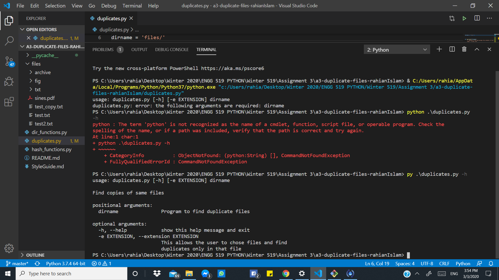
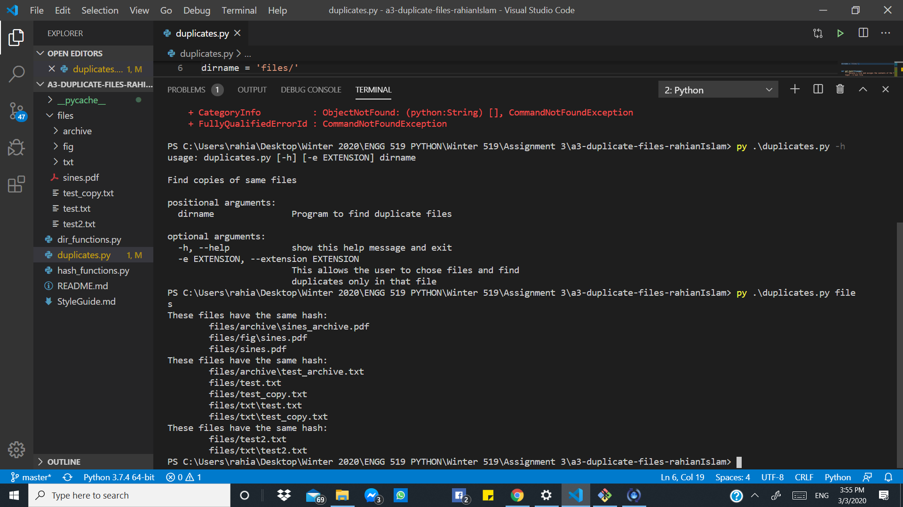
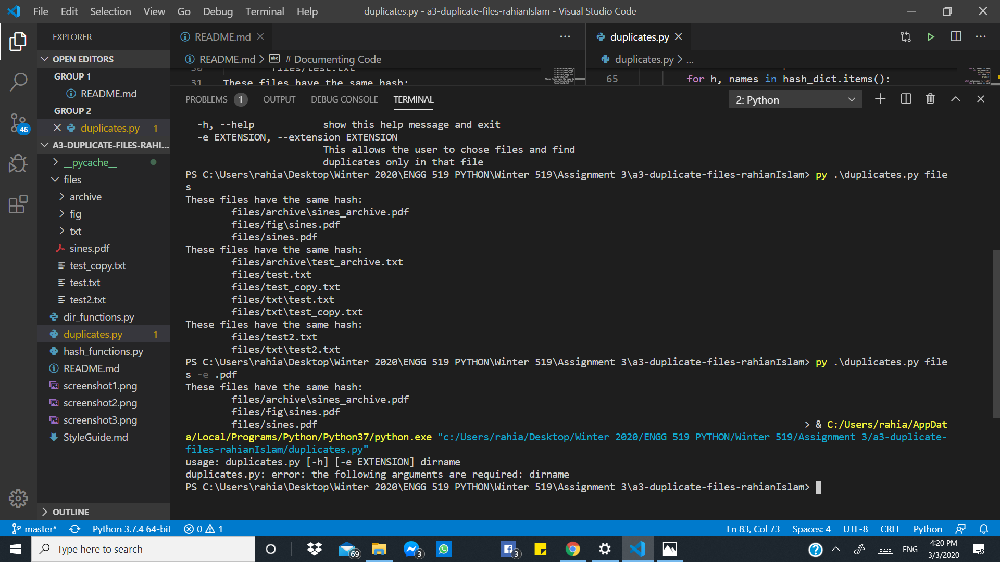

# a3-duplicate_files
Scan a directory tree and find duplicate files based on their hash

This assignment was inspired by Exercise 14.3 in ThinkPython 2e with code available at http://greenteapress.com/thinkpython2/code/find_duplicates.py.

Author: Rahian Islam
# Problem statement
Building on `hash_functions.py` and `dir_functions.py`, a colleague put together initial code in `duplicates.py`. This code allows you to specify a directory, and the program scans the directory recursively to find all files in this folder and sub-folders. For each file, its hash is calculated. A list of files with matching hash values is printed. These are potential duplicate files.

The goal is to:
1. Add docstrings and comments to `duplicates.py`
2. Add a command line interface to this program with one mandatory argument, `dirname`, and use **MD5**, rather than **hash8** as the hashing algorithm. Make sure to add description and help text.
3. Extend the code and command line interface to optionally accept a file extension and only find duplicates with this file extension. The option should be `-e` and `--extension`. For text files, usage would be `-e .txt` or `--extension .txt`. Make sure to add help text.
4. (optional) Extend the code and command line interface to specify the hash algorithm used. Make sure to add help text.

# What to do
Work through goals 1. - 3. (optionally 4.) outlined above by editing `duplicates.py` and using git to capture your changes. Test your code with the sample file structure provided:

`python duplicates.py files` should print
```
These files have the same hash:
        files/fig/sines.pdf
        files/archive/sines_archive.pdf
        files/sines.pdf
These files have the same hash:
        files/archive/test_archive.txt
        files/txt/test_copy.txt
        files/txt/test.txt
        files/test_copy.txt
        files/test.txt
These files have the same hash:
        files/txt/test2.txt
        files/test2.txt
```

`python duplicates.py files -e .pdf` should print
```
These files have the same hash:
        files/fig/sines.pdf
        files/archive/sines_archive.pdf
        files/sines.pdf
```

Document your code, use the [style guide]
(StyleGuide.md).

# Documenting Code


Create a screenshot of your programm running the following commands:
- `python duplicates.py -h` 
- `python duplicates.py files`
- `python duplicates.py files -e .pdf`  
  
Edit `README.md` (this file) and include the screenshot and instructions in the _How to run this program_ section 






below (similar to `a0-classroom`). 

If your ouput does not match the example output above, include a paragraph why you think this is and what you would do to find the source of this discrepancy.

Make sure final version of `duplicates.py`, `README.md` and `screenshot.png` are commited to git and pushed to github. 

# How to run this program
As you can see the code does not run using "python" in the command interface. Instead I had to do my research and found that I had to use 'py'. 

so 'py duplicates.py files -e .pdf' gives the last result on the last screenshot.

